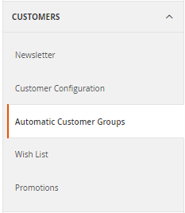
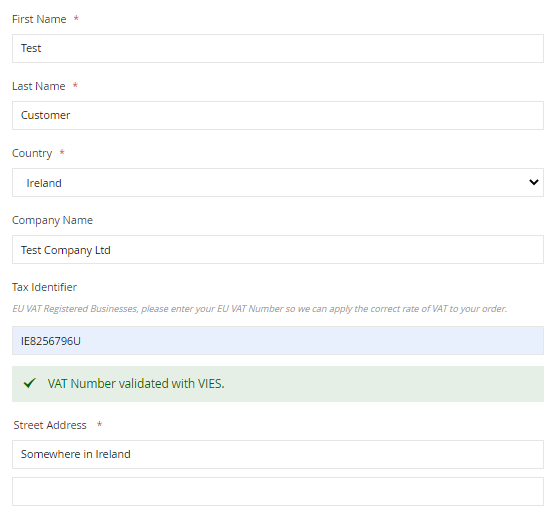
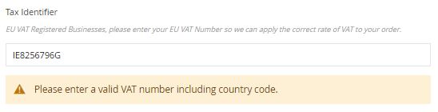
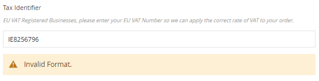
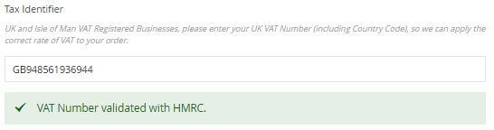
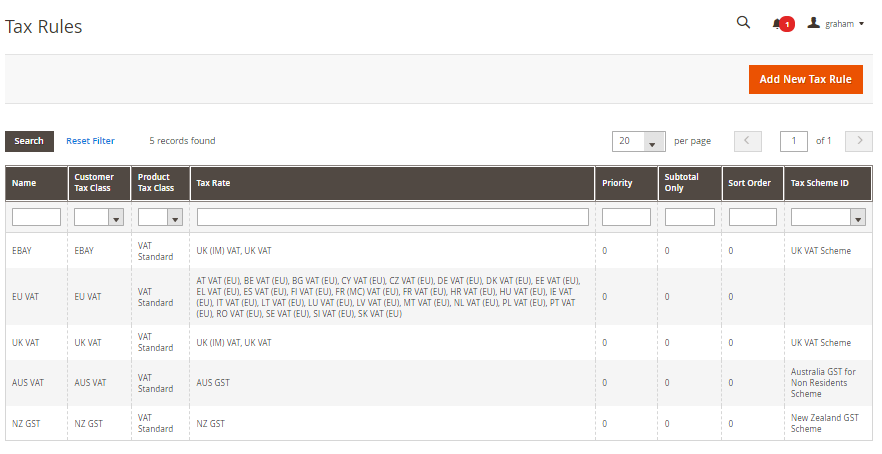
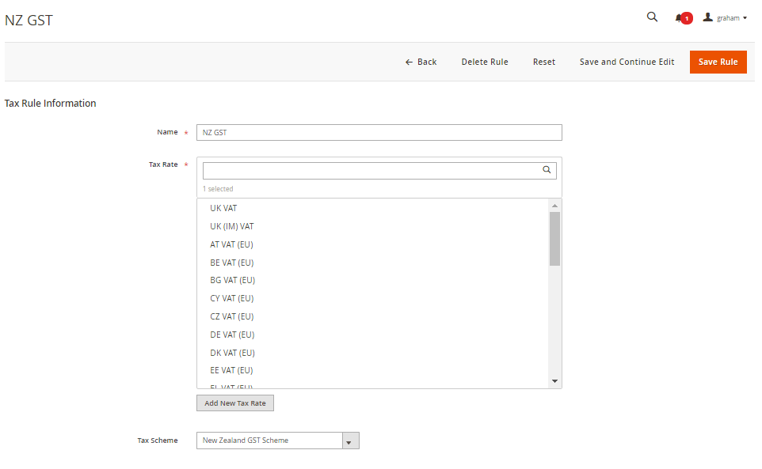
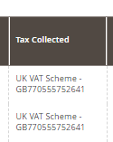

<h1>AutoCustomerGroup</h1>

Magento 2 Module - Auto Assign Customer Group based on Tax Scheme validation

<h2>Features</h2>
<ul>
<li>Country Specific module addons available for UK, EU, Norway VOEC, AU GST and NZ GST Schemes</li>
<li>Validation of Customers Tax ID on frontend during checkout, including feedback of validation status to customer.</li>
<li>Automatically change customer group during frontend orders based on order contents, Tax ID and Country.</li>
<li>Admin Create Customer - Tax ID's are validated and saved with the order address, but group change functionality disabled (only available while placing orders).</li>
<li>Admin Create Order - Tax ID's are validated using the "validate" link during order creation, and customer is assigned new group if applicable.</li>
<li>Option to add scheme currencies to Base Currency list for automatic exchange rate download, or able to use hard coded exchange rates.</li>
<li>Module can be disabled, where legacy Magento functionality is restored. Module can be enabled/disabled on a per store basis with legacy functionality on one store, and new functionality on another store.</li>
<li>Extends Tax Rate functionality to allow linking of Tax Rates to Tax Schemes</li>
<li>Includes Code to allow retieval of Order Tax Rates and linked Tax Schemes, for example when producing Invoice PDF's so the Tax Scheme details can be added to the PDF depending on which rates were used on the order. (example code below)</li>
<li>Records details of Tax Scheme used on orders to new table sales_order_tax_scheme.</li>
<li>Sales Order Grid column to show Tax Scheme Details for order.</li>
</ul>

<h2>Country Specific Modules</h2>

For this module to do anything, you need to install one or more country specific modules. Install all of the modules
applicable for the countries that you sell into (not from). Let me know if you've written a module for AutoCustomerGroup so I can list it here.

Modules available :

<ul>
<li>composer require gwharton/module-autocustomergroup-australia</li>
<li>composer require gwharton/module-autocustomergroup-eu</li>
<li>composer require gwharton/module-autocustomergroup-newzealand</li>
<li>composer require gwharton/module-autocustomergroup-norway</li>
<li>composer require gwharton/module-autocustomergroup-uk</li>
</ul>

<h2>Overview</h2>

Changes introduced around the world to various countries tax schemes to better support online shopping, are not well support by the Magento Tax system. These changes are required URGENTLY, and while Magento consider the changes required and work towards a permanent solution, this module can be used as an interim measure.

The module should be considered BETA. I encourage users to analyse the code, suggest improvements, generate PR's where applicable.

Once customers have been placed in an appropriate group, tax rules can be configured to apply different taxes to each group, depending on what is required.

When enabled, this module replaces the existing Magento VIV functionality with a new, more extendable system. When the module is disabled, the existing Magento functionality is restored.

The module allows different base currencies to be used per website, if the price scope is set per website.

<h2>Configuration Options</h2>
<ul>
<li><b>Enable Module</b> - This activates and deactivates the module. When turned off, orders will be processed using the existing Magento settings and the existing VAT control is used on the frontend. The module can be enabled and disabled on a per site basis.</li>
<li><b>Validate on Each Transaction</b> - If the order is being placed by a customer that has existing Tax ID Validation data stored in their shipping address, then this can be re-used on each subsequent order, or it can be revalidated every time. This only applies for Customers with accounts with stored Shipping Addresses. This option does nothing for guest checkouts.</li>
<li><b>VAT/Tax Identifier Frontend Label</b> - The label for the VAT/Tax Id Input Box at Checkout. Magento's default is "VAT Number". The default for this module is "Tax Identifier", but you can set this to anything you like.</li>
<li><b>Enable download of Additional Base Currencies</b> - To enable currency conversion of Import Thresholds using Magento Currency subsystem, the enabled Scheme Currencies need to be configured as additional Base Currencies within Magento. Currency download will need to be triggered after enabling this setting. This enables the downloading of the correct exchange rates for use in this module, provided you haven't selected to use manual exchange rates within the addon modules. This can be verified in Stores -> Currency Rates.</li>
<li><b>Enable recording of Tax Scheme details to sales_order_tax_scheme table</b> - When an order is placed, and a tax rule is triggered that is linked to a tax scheme, then the tax scheme information is recorded in table sales_order_tax_scheme in the database.</li>
<li><b>Default Customer Group for Guest Orders</b> - If the order is a guest order, which group should be used if none of the schemes generate a group change. (Existing customers will be assigned their correct customer group prior to being changed by this module).</li>
</ul>

<h2>Frontend Validation Feedback</h2>

When enabled, this module replaces the frontend Form Element for the VAT/Tax ID Input box. If the currently selected Country has a Tax Scheme
associated with it, and the Tax Scheme enabled, and a valid format VAT/Tax Id is input on the frontend, then the Id is validated by the relevant
Tax Scheme and the results displayed to the customer. As soon as a country is selected that has a valid Tax Scheme associated with
it, the customer is presented with a prompt above the input field, notifying what they need to enter.

<h4>Valid Irish VAT Number</h4>

<h3>Correct format but not valid</h3>

<h3>Wrong Format</h3>

<h3>Valid UK VAT Numnber</h3>

<h2>Tax Rule to Tax Scheme Links</h2>

The module allows you to link each tax rule to a particular tax scheme. In post order functions, this allows you to query this module using order details, and obtain the list of tax rules that were applicable to the order, and return the TAX Scheme Registration Numbers linked to these rules. This is useful
when generating invoices for example.

The links can be set under the existing Tax Rules Screens

<h2>Sales Order Grid</h2>

The module introduces a new Sales Order Grid column that will display details of the Tax Scheme used for the order.

<h2>Getting Information on Tax Schemes used on Order</h2>

This module stores additional information into the sales_order_tax_scheme table whenever
an order is placed that triggered a tax rule linked to a Tax Scheme.

This information can be easily accessed so that information on which tax schemes were
used on an order, can be included on the Invoice PDF's for example.

The following code shows how this can be achieved.

<pre>
<code>
    
    use Gw\AutoCustomerGroup\Model\ResourceModel\OrderTaxScheme\CollectionFactory;

    /**
     * @var CollectionFactory
     */
    private $orderTaxSchemeCollectionFactory;

    ...
    ...
    ...

    $orderTaxSchemes = $this->orderTaxSchemeCollectionFactory->create()->loadByOrder($order);
    foreach ($orderTaxSchemes as $orderTaxScheme) {
        $storeCurrency = $this->currencyFactory->create()->load($orderTaxScheme->getStoreCurrency());
        $schemeCurrency = $this->currencyFactory->create()->load($orderTaxScheme->getSchemeCurrency());
        $baseCurrency = $this->currencyFactory->create()->load($orderTaxScheme->getBaseCurrency());

        output("TAX Summary - " . $orderTaxScheme->getName());
        output("Registration Number - " . $orderTaxScheme->getReference());
    }
</code>
</pre>

<h2>Known Limitations</h2>

The following Totals Collectors within Magento are run before this module assesses whether any group change is required.

<ul>
<li>Magento\Quote\Model\Quote\Address\Total\Subtotal</li>
<li>Magento\Tax\Model\Sales\Total\Quote\Subtotal</li>
<li>Magento\Weee\Model\Total\Quote\Weee</li>
<li>Magento\SalesRule\Model\Quote\Discount</li>
</ul>

If the order includes a discount or weee charges, then these will be included in the order totals before assessing any 
order thresholds. Whilst this means that the order will be properly assessed including discounts and wee charges, should 
this module determine that the customer group should change, discounts and wee charges on the order are NOT reassessed 
after the group has changed. e.g If you have a discount that is applied to orders from the default customer group and 
the module adjusts the customer group to one that the discount does not apply, the discount will still be applied
on the order.

